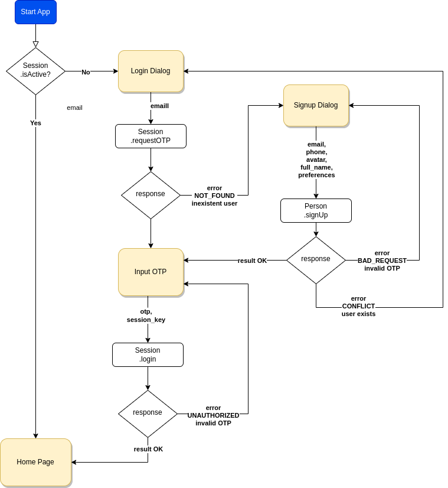

# Onboarding

Shows the onboarding process for the SocialCap App. 

### Features

- No password: Does not require or asks for a password, only an email is required.

- No wallet/account: Can do onboarding even if it does not have a MINA account or wallet.
- Provide a user experience similar to Web2 apps.

**Design decisions**

- Use OTP (One Time Password) sent to the email instead of creating a password. This simplifies the onboarding process, and can be latter enhance security by using a second device (telegram/phone) for login.

- Allow @anyone to start navigating the App without needing a MINA wallet. Users are able to see public info such as available communities, other users in those communities, its credentials, etc which do not strictly require a MINA transaction/payment.
- Provide a user experience similar to Web2 apps. This helps for user with no crypto/wallet experience, allowing them to use and get used to the App before requiring a wallet.
- Ask for a MINA account when really needed (for example register a new Community). When the user is confident about the App and needs to do something special (such as register a new community, request membership or claim a credential) he will be willing to take the effort to opena Wallet and MINA account and pay for it.
- Have a session authorized token not dependent on the MINA account. This is needed so we can have a user experience personalized for each person, having its own preferences, etc. even without a MINA account.
- Use a "centralized off-chain storage" (such as Postgres). Because MINA anyway requires off-chain storage, we will use (for now) a centralized DB for storing info needed for the App. When some efficient and decentralized solution appears we may migrate to it.
- Do no store any private personal information. Even when most info is already public (such as communities, its members and credentials) we will avoid storing any private personal information in the centralized storage.

### Onboarding OTP flow

###  API Clients 

- [Sessions API client](../api/client-sessions.md)
- [Personas API client](../api/client-personas.md)

